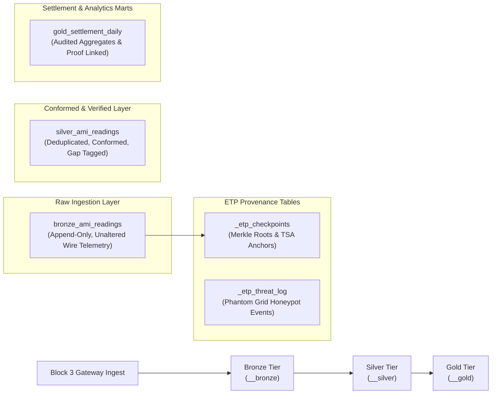

# DD-001 — EnergyTrust Protocol: Data Design (Apache Iceberg & Graph)

**Document ID:** DD-001  
**Version:** 2.1  
**Issued:** 2026-09-06T17:42:00Z  
**Status:** Approved Specification  

---

## 1. Architectural Justification for Apache Iceberg

The EnergyTrust Protocol requires a data storage architecture capable of supporting **52+ billion rows per year** per 3-million-meter estate, maintaining strict historical reproducibility, and providing multi-engine compatibility without vendor lock-in.

```
┌─────────────────────────────────────────────────────────────────────────────┐
│                    Iceberg Feature Mapping Matrix                           │
└─────────────────────────────────────────────────────────────────────────────┘
```

| Enterprise Requirement | Apache Iceberg Feature | Architectural Benefit |
|---|---|---|
| **Reproducible As-Of Settlement Queries** | Snapshot Isolation & Time Travel | Enables analysts to re-run settlement calculations as of an exact snapshot ID months or years later. |
| **Efficient Pruning across 52B Rows** | Manifest Files & Hidden Partitioning | Prunes 99.7% of table manifests based on query date range without explicit partition column syntax. |
| **20-Year Asset Lifecycle Schema Evolution** | In-place Schema & Partition Evolution | Adds new fields (e.g., Post-Quantum signatures) without rewriting historical Parquet files. |
| **Vendor Independence & Multi-Engine Access** | Open Storage Format | Tables readable directly by DuckDB, Spark, Trino, Dremio, and Snowflake. |
| **Snapshot Tamper Lock** | Table Property Metadata Guards | Prevents automated storage cleanup tools from purging snapshots within the 7-year legal audit window. |

---

## 2. Medallion Data Architecture

ETP organizes telemetry data into three distinct Medallion namespaces to guarantee data integrity:



---

## 3. Executable SQL DDL Specifications

### 3.1 Raw Ingestion Table — `bronze_ami_readings`

```sql
CREATE TABLE <tenant>__bronze.bronze_ami_readings (
    -- Business Domain Columns
    mpan                    STRING        NOT NULL,  -- Meter Point Administration Number
    reading_ts              TIMESTAMPTZ   NOT NULL,
    settlement_period       INT           NOT NULL,  -- Half-hourly settlement period (1..48)
    reading_kwh             DECIMAL(12,3) NOT NULL,
    voltage_v               DECIMAL(8,2),
    feeder_id               STRING,
    substation_id           STRING,
    gsp_group               STRING,

    -- ETP Verification Provenance Columns (First-Class Schema Citizens)
    etp_block_hash          STRING        NOT NULL,
    etp_prev_hash           STRING,
    etp_nonce               BIGINT        NOT NULL,
    etp_key_id              STRING        NOT NULL,
    etp_crypto_suite_id     STRING        NOT NULL,
    etp_signature           STRING        NOT NULL,
    etp_verified_at         TIMESTAMPTZ   NOT NULL,
    etp_verify_status       STRING        NOT NULL,  -- VERIFIED | CHAIN_GAP | FAILED | UNVERIFIED
    etp_sentinel_score      DOUBLE,
    etp_gateway_id          STRING        NOT NULL,

    -- Lineage Metadata
    ingested_at             TIMESTAMPTZ   NOT NULL,
    source_batch_id         STRING        NOT NULL
)
USING iceberg
PARTITIONED BY (days(reading_ts), bucket(16, mpan))
TBLPROPERTIES (
    'layer'                        = 'bronze',
    'meldra.etp.enabled'           = 'true',
    'meldra.etp.gateway_id'        = 'gw-uk-01',
    'meldra.retention.min_days'    = '2555',     -- 7-year retention lock
    'meldra.data.classification'   = 'restricted',
    'write.target-file-size-bytes' = '536870912' -- 512 MB target file size
);
```

---

### 3.2 Daily Checkpoint Table — `_etp_checkpoints`

```sql
CREATE TABLE <tenant>__bronze._etp_checkpoints (
    mpan_bucket             INT           NOT NULL,
    mpan                    STRING        NOT NULL,
    day                     DATE          NOT NULL,
    merkle_root             STRING        NOT NULL,
    leaf_count              INT           NOT NULL,
    first_nonce             BIGINT        NOT NULL,
    last_nonce              BIGINT        NOT NULL,
    gap_count               INT           NOT NULL,
    built_at                TIMESTAMPTZ   NOT NULL,
    anchor_ref              STRING,                  -- RFC 3161 TSA Token / WORM Object Ref
    anchor_at               TIMESTAMPTZ,
    status                  STRING        NOT NULL   -- BUILT | ANCHORED | FAILED
)
USING iceberg
PARTITIONED BY (days(day), bucket(16, mpan))
TBLPROPERTIES (
    'layer'                        = 'provenance',
    'meldra.retention.min_days'    = '36500'    -- Permanent retention
);
```

---

### 3.3 Deception & Threat Log Table — `_etp_threat_log`

```sql
CREATE TABLE <tenant>__security._etp_threat_log (
    event_id                STRING        NOT NULL,
    timestamp               TIMESTAMPTZ   NOT NULL,
    source_ip               STRING        NOT NULL,
    user_agent              STRING,
    requested_route         STRING        NOT NULL,
    epoch_window            BIGINT        NOT NULL,
    honeypot_session_id     STRING,
    session_duration_s      DOUBLE,
    payload_sample          STRING,
    stix_export_status      STRING        NOT NULL   -- PENDING | EXPORTED | FAILED
)
USING iceberg
PARTITIONED BY (days(timestamp))
TBLPROPERTIES (
    'layer'                        = 'security',
    'meldra.retention.min_days'    = '400'
);
```

---

## 4. Medallion Pipeline Transformations

```sql
-- Step 1: Promote Bronze to Conformed Silver Tier (Deduplicate & Tag Gaps)
INSERT INTO <tenant>__silver.silver_ami_readings
SELECT 
    mpan,
    reading_ts,
    settlement_period,
    reading_kwh,
    voltage_v,
    feeder_id,
    substation_id,
    gsp_group,
    etp_block_hash,
    etp_verify_status,
    ingested_at
FROM (
    SELECT *,
           ROW_NUMBER() OVER (
               PARTITION BY mpan, reading_ts 
               ORDER BY etp_nonce DESC, ingested_at DESC
           ) AS dedup_rank
    FROM <tenant>__bronze.bronze_ami_readings
    WHERE etp_verify_status IN ('VERIFIED', 'CHAIN_GAP')
)
WHERE dedup_rank = 1;
```

---

## 5. Apache AGE Graph Architecture

ETP integrates two graph models inside Apache AGE to support topology analytics and threat tracking.

### 5.1 Network Topology Graph
Vertices and edges represent physical grid assets and supply paths:

```
Vertices:  (:GSP {gsp_group})
           (:Substation {substation_id, name, lat, lon})
           (:Feeder {feeder_id, rating_amps})
           (:Meter {mpan, install_date})

Edges:     (:GSP)-[:SUPPLIES]->(:Substation)
           (:Substation)-[:FEEDS]->(:Feeder)
           (:Feeder)-[:SERVES]->(:Meter)
```

#### Cypher Query — UC-04 Upstream Substation Resolution
```cypher
SELECT * FROM cypher('<tenant>__topology_graph', $$
    MATCH (m:Meter)<-[:SERVES]-(f:Feeder)<-[:FEEDS]-(s:Substation)
    WHERE m.mpan IN $affected_mpans
    RETURN s.substation_id AS substation, count(DISTINCT m) AS affected_count
    ORDER BY affected_count DESC
$$) AS (substation agtype, affected_count agtype);
```

---

### 5.2 Threat Propagation Graph
Tracks reconnaissance campaigns across rotating routes:

```cypher
SELECT * FROM cypher('<tenant>__threat_graph', $$
    MATCH (s:Source)-[:ATTEMPTED]->(r:RouteAttempt)
    WHERE r.ts > $since_timestamp
    WITH r.route AS route, collect(DISTINCT s.ip) AS source_ips
    WHERE size(source_ips) > 1
    RETURN route, source_ips
$$) AS (route agtype, source_ips agtype);
```

### 5.3 Multi-Tenant Isolation Strategy for Apache AGE (Mitigating L6 Gap)
To prevent cross-tenant graph query leaks, Apache AGE graph names are dynamically scoped using the pattern: `<tenant_id>__<graph_name>`. The query proxy validates that incoming Cypher execution strings match the user's session tenant token before dispatch.

---

## 6. Data Classification & Security Enforcement

```
┌─────────────────────────────────────────────────────────────────────────────┐
│                       Data Masking Architecture                             │
│                                                                             │
│  User Context (Role = Analyst)                                              │
│        │                                                                    │
│        ▼                                                                    │
│  [ Session Scope Guard ] ──► Applies Pre-Relation Masking Transformation    │
│        │                                                                    │
│        ▼                                                                    │
│  Engine Relation (mpan = "MPAN-***-3456", reading_kwh = 0.412)              │
│        │                                                                    │
│        ▼                                                                    │
│  [ DuckDB Query Execution Engine ] (Raw PII value is NEVER accessible)      │
└─────────────────────────────────────────────────────────────────────────────┘
```

| Classification | Target Columns | Access Control & Masking Policy |
|---|---|---|
| **Restricted** | `mpan`, Customer Name, Serial | Masked via deterministic hash unless role holds `RESTRICTED_READ` grant. |
| **Sensitive** | `reading_kwh`, `voltage_v` | Row-filtered based on regional DNO role assignment. |
| **Internal** | `feeder_id`, `substation_id` | Accessible to authenticated utility operators. |
| **Open** | Aggregate settlement totals | Broad read access across enterprise roles. |
| **Unmasked Provenance**| `etp_block_hash`, `etp_verify_status` | **NEVER MASKED.** Must remain readable to verify data proofs. |

---

## 7. Retention Policy & Snapshot Guards

`expire_snapshots()` operations hard-block on any table carrying `meldra.retention.min_days`:

```python
def safe_expire_snapshots(table, older_than_ts: datetime):
    min_days = int(table.properties.get("meldra.retention.min_days", 0))
    if min_days > 0:
        retention_boundary = datetime.now(timezone.utc) - timedelta(days=min_days)
        if older_than_ts < retention_boundary:
            raise RetentionLockViolation(
                f"Cannot expire snapshots older than {retention_boundary.isoformat()}. "
                f"Table retention lock set to {min_days} days."
            )
    table.expire_snapshots(older_than_ts)
```

---

## 8. IEC Common Information Model (CIM) Mapping & Telemetry Provenance Extension

To achieve enterprise credibility with major Distribution Management System (DMS), Energy Management System (EMS), and Meter Data Management System (MDMS) vendors (e.g., Siemens, GE, Schneider Electric, Itron), ETP maps physical Iceberg columns directly to standard **IEC Common Information Model (CIM)** classes.

### 8.1 International Standard References
- **IEC 61970-301:2020:** Base abstract Common Information Model for electric utility management.
- **IEC 61968-9:** Distribution management system extensions — Meter reading and control.
- **IEC 62325:** European energy market exchange standards.
- **ENTSO-E CGMES:** Common Grid Model Exchange Standard (built on IEC 61970 parts 301, 302, 452, 453, 456, 457, 552 & IEC 61968-4).

### 8.2 ETP Iceberg to IEC CIM Class Mapping Table

| Physical Iceberg Column | IEC CIM Class & Property | IEC Standard | Description |
|---|---|---|---|
| `mpan` | `cim:UsagePoint.mRID` / `cim:Meter.mRID` | IEC 61968-9 | Master resource ID for meter endpoint. |
| `reading_ts` | `cim:IntervalReading.timeStamp` | IEC 61968-9 | UTC ISO-8601 interval timestamp. |
| `settlement_period` | `cim:ReadingQuality.type` | IEC 62325 | Settlement market interval index (1..48). |
| `reading_kwh` | `cim:IntervalReading.value` | IEC 61968-9 | Active energy quantity (ReadingType: kWh). |
| `voltage_v` | `cim:IntervalReading.value` | IEC 61968-9 | RMS voltage quantity (ReadingType: Volts). |
| `feeder_id` | `cim:ACLineSegment.mRID` | IEC 61970-301 | Feeder conductor segment identifier. |
| `substation_id` | `cim:Substation.mRID` | IEC 61970-301 | Upstream distribution substation. |
| `gsp_group` | `cim:SubGeographicalRegion.mRID` | IEC 61970-301 | Grid Supply Point regional group. |

---

### 8.3 International Contribution: Proposed `cim:TelemetryProvenance` Extension Class

> [!IMPORTANT]
> The official IEC 61970/61968 standards model grid topology and meter readings, but **contain zero classes for cryptographic wire provenance**. ETP defines a proposed CIM extension class, `cim:TelemetryProvenance`, to bridge wire-to-rest integrity gaps in international standards.

```xml
<!-- IEC CIM RDF/XML Export Profile with ETP Provenance Extension -->
<rdf:RDF xmlns:rdf="http://www.w3.org/1999/02/22-rdf-syntax-ns#"
         xmlns:cim="http://iec.ch/TC57/CIM100#"
         xmlns:etp="http://energytrustprotocol.org/schema/cim-extension#">

  <cim:UsagePoint rdf:about="#_MPAN-1200012345678">
    <cim:IdentifiedObject.mRID>MPAN-1200012345678</cim:IdentifiedObject.mRID>
    <cim:IdentifiedObject.name>Smart Meter Feeder F-4471 Point</cim:IdentifiedObject.name>
  </cim:UsagePoint>

  <cim:IntervalReading rdf:about="#_Reading_20260906_173000">
    <cim:IntervalReading.timeStamp>2026-09-06T17:30:00.000Z</cim:IntervalReading.timeStamp>
    <cim:IntervalReading.value>0.412</cim:IntervalReading.value>
    <cim:IntervalReading.UsagePoint rdf:resource="#_MPAN-1200012345678"/>
    
    <!-- ETP Telemetry Provenance Extension Properties -->
    <etp:TelemetryProvenance.blockHash>9c2e4f71a83b...</etp:TelemetryProvenance.blockHash>
    <etp:TelemetryProvenance.previousBlockHash>a3f1b2c4...</etp:TelemetryProvenance.previousBlockHash>
    <etp:TelemetryProvenance.nonce>184291</etp:TelemetryProvenance.nonce>
    <etp:TelemetryProvenance.cryptoSuiteId>ECDSA-P256-SHA256-v1</etp:TelemetryProvenance.cryptoSuiteId>
    <etp:TelemetryProvenance.verificationStatus>VERIFIED</etp:TelemetryProvenance.verificationStatus>
    <etp:TelemetryProvenance.anchorReference>tsa:2026-09-06T00:04:12Z:7b1f...</etp:TelemetryProvenance.anchorReference>
  </cim:IntervalReading>

</rdf:RDF>
```

---

## 9. Document Control

| Version | Date | Author | Summary of Changes |
|---|---|---|---|
| 1.0 | 2026-09-06T09:40:00Z | Lead Architect | Initial Baseline |
| 2.0 | 2026-09-06T17:39:00Z | Lead Architect | Added full Iceberg DDLs, Medallion lifecycle SQL, Apache AGE graph queries, and Retention guards |
| 2.1 | 2026-09-06T17:42:00Z | Lead Architect | Added IEC CIM (IEC 61970/61968) Mapping & Proposed `cim:TelemetryProvenance` Extension Profile |
