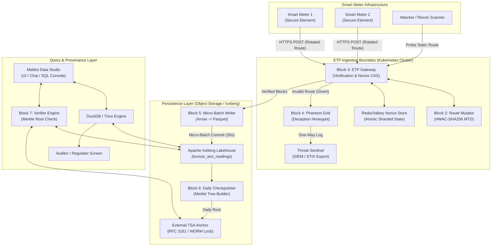
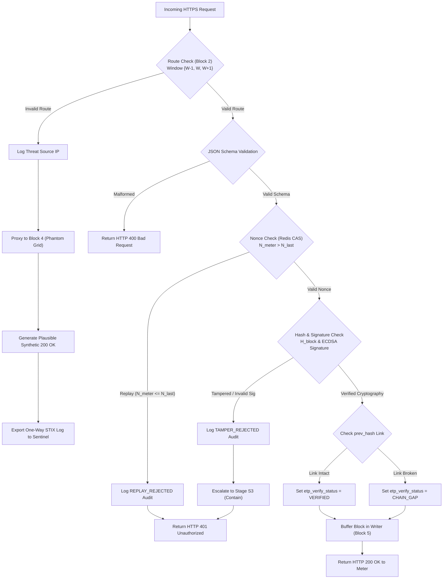
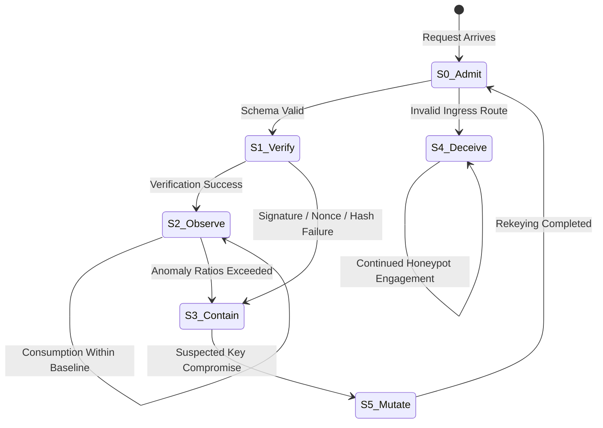

# HLD-001 — EnergyTrust Protocol: High-Level Design Specification

**Document ID:** HLD-001  
**Version:** 2.0  
**Issued:** 2026-09-06T17:37:00Z  
**Status:** Approved Specification  

---

## 1. Architectural Design Principles

| ID | Principle | Architectural Implication |
|---|---|---|
| **P1** | **Fail Closed** | Any boundary component unable to verify caller authorization or route authenticity must default to rejection or diversion. |
| **P2** | **Contextual Isolation** | Tenant ID, user role, and security boundaries are bound strictly from verified server context, never from client parameters. |
| **P3** | **Open Data Specifications** | All persistent data is written as Apache Iceberg Parquet files on standard object storage, accessible by Spark, Trino, and DuckDB without vendor locking. |
| **P4** | **Decoupled Intelligence & Computation** | AI models generate standard SQL queries; execution, aggregation, and verification logic remain strictly inside deterministic compute engines. |
| **P5** | **Comprehensive Audit Trails** | Every system action emits immutable audit events with UTC ISO-8601 millisecond timestamps, actor identities, and outcome tokens. |
| **P6** | **Modular Block Autonomy** | The 7 system blocks interact strictly via simple typed JSON/gRPC contracts with zero shared in-memory object references. |
| **P7** | **Strict Verification Honesty** | Verification modules return granular statuses (`VERIFIED`, `CHAIN_GAP`, `FAILED`); unverified operations are never reported as successful. |

---

## 2. End-to-End System Context & Topology

The system comprises smart meter edge endpoints, an MTD ingestion gateway, active deception honeypots, micro-batch lakehouse writers, Merkle checkpointers, and analytical query engines.



---

## 3. Gateway Ingestion & Deception Flowchart

Requests entering the ETP gateway follow a deterministic, DoS-resistant validation sequence before committing to storage or diverting to deception:



---

## 4. Architectural Escalation State Machine (Patent §5.5)

The gateway maintains a dynamic security escalation state machine for every meter device and network source IP:



| Stage | Name | Trigger Condition | System Action |
|---|---|---|---|
| **S0** | **ADMIT** | Payload arrives at gateway endpoint. | Execute HTTP route parsing and payload structure validation. |
| **S1** | **VERIFY** | Route valid; schema compliant. | Execute fast nonce CAS check, hash recomputation, and ECDSA signature verification. |
| **S2** | **OBSERVE** | Cryptography verified. | Ingest block; pass to Threat Sentinel for baseline consumption ratio analysis. |
| **S3** | **CONTAIN** | Signature failure, hash mismatch, or replay attempt. | Block ingestion for target `mpan`; emit alert to SOC. |
| **S4** | **DECEIVE** | Ingress request hits stale or unrotated route. | Proxy connection to Phantom Grid honeypot; respond with synthetic HTTP 200 OK. |
| **S5** | **MUTATE** | Confirmed device key compromise or leak. | Trigger key revocation; initiate out-of-band OTA rekeying workflow. |

---

## 5. Specification of the 7 Core System Blocks

### Block 1 — Meter Edge Simulator / Firmware Engine
- **Responsibility:** Monotonic nonce tracking, state persistence, block hashing, ECDSA signing.
- **Input:** $kWh$ reading, voltage, current timestamp, key pair.
- **Output:** Canonical JSON telemetry block.
- **Dependencies:** Hardware Secure Element (SE) or local TPM key store.
- **Failure Boundary:** If SE fails, meter halts telemetry generation; never emits unsigned blocks.

### Block 2 — Ingress Route Mutator
- **Responsibility:** Computes rotating ingress route strings based on shared key and clock window.
- **Input:** $K_{secret}$, epoch timestamp $t$, window size $T_{window} = 60 \text{ s}$.
- **Output:** Valid route map `{"prev": str, "current": str, "next": str}`.
- **Properties:** Pure mathematical function. Zero state, zero database I/O. Execution latency $<1 \ \mu\text{s}$.

### Block 3 — ETP Ingestion Gateway
- **Responsibility:** Route matching, scheme validation, atomic nonce CAS checks, cryptographic verification, deception dispatch.
- **Input:** Incoming HTTP POST request.
- **Output:** Response payload ($200/400/401$), audit event, writer buffer dispatch.
- **State Store:** Redis / Valkey clustered memory store for $O(1)$ atomic nonce checks.

### Block 4 — Phantom Grid Deception Honeypot
- **Responsibility:** Simulates realistic head-end system telemetry responses for invalid-route traffic.
- **Input:** Proxied HTTPS connection from Gateway.
- **Output:** Synthetic JSON response, one-way threat log.
- **Isolation:** Deployed on isolated network segment with **zero egress routes** to production infrastructure.

### Block 5 — Micro-Batch Lakehouse Writer
- **Responsibility:** Buffers incoming verified blocks and appends to Apache Iceberg tables in micro-batches.
- **Batch Policy:** Flush every $30 \text{ seconds}$ OR $50,000 \text{ blocks}$, whichever occurs first.
- **Output:** High-density, compressed Parquet data files committed via PyIceberg / Java Iceberg API.

### Block 6 — Daily Merkle Checkpointer
- **Responsibility:** Builds daily per-meter and estate-wide Merkle trees; anchors roots externally.
- **Execution:** Offline batch job scheduled daily at 00:05 UTC.
- **Anchoring Target:** RFC 3161 Timestamp Authority (TSA) or AWS S3 Object Lock (WORM).

### Block 7 — Provenance Verification Engine
- **Responsibility:** Validates analytical SQL query results against anchored Merkle roots.
- **Input:** Target table, date range, `mpan` selection.
- **Output:** Comprehensive `VerificationReport` JSON object containing row counts, verified counts, chain gaps, and TSA references.

---

## 6. Threat Modeling & STRIDE Security Architecture

```
┌─────────────────────────────────────────────────────────────────────────────┐
│                          STRIDE Threat Analysis                             │
└─────────────────────────────────────────────────────────────────────────────┘
```

| STRIDE Category | Threat Vector | ETP Architectural Mitigation |
|---|---|---|
| **Spoofing** | Attacker impersonates legitimate smart meter. | Block 3 enforces ECDSA-P256 signature verification backed by meter hardware Secure Elements. |
| **Tampering** | Man-in-the-Middle alters consumption $kWh$ values. | Byte-level canonical block hash $H_{block}$ recomputed at gateway; mismatch triggers S3 containment. |
| **Repudiation** | Utility customer claims billing reading was fabricated by platform. | Immutable daily Merkle tree checkpoints anchored to third-party RFC 3161 TSA provide proof. |
| **Information Disclosure** | Recon scanner discovers telemetry API endpoints. | Block 2 Moving Target Defense continuously mutates endpoints; unauthorized probes diverted to Phantom Grid. |
| **Denial of Service** | Volumetric replay flood aimed at exhausting crypto CPU cores. | Gateway checks atomic monotonic nonce in Redis *before* executing expensive ECDSA signature verifications. |
| **Elevation of Privilege** | Attacker breaches Phantom Grid honeypot and pivots to lakehouse. | Phantom Grid is deployed in a zero-egress network namespace with read-only synthetic data bindings. |

---

## 7. Scaling, Throughput, & High Availability

### 7.1 Sustained Load Specifications (3-Million Meter Estate)
- **Sustained Ingestion:** 1,700 blocks/second.
- **Peak Scheduled Wake Load:** 10,000 blocks/second.
- **ECDSA Verification Capacity:** ~35,000 verifications/second per 8-core gateway node (OpenSSL optimized).
- **Nonce Store Bottleneck Mitigation:** Redis / Valkey sharded by `mpan` hash ring. Nonce validation requires 1 integer comparison ($<50 \ \mu\text{s}$).

### 7.2 Micro-Batch File Size Optimization
At 1,700 blocks/sec, unbatched commits would create 1,700 small files/sec, degrading object storage performance. Micro-batching for 30 seconds accumulates ~51,000 rows (~4.2 MB compressed Parquet), producing optimal Iceberg table layout.

```
┌─────────────────────────────────────────────────────────────────────────────┐
│                  Micro-Batch Buffer & Ingestion Pipeline                    │
│                                                                             │
│  Gateway Thread 1 ──┐                                                       │
│  Gateway Thread 2 ──┼──► [ In-Memory Buffer ] ──► [ Arrow RecordBatch ]      │
│  Gateway Thread N ──┘     (Flush: 30s / 50k)            │                     │
│                                                       ▼                     │
│                                            [ PyIceberg Commit ]             │
│                                                       │                     │
│                                                       ▼                     │
│                                           S3: bronze_ami_readings           │
└─────────────────────────────────────────────────────────────────────────────┘
```

---

## 8. Known Architectural Limitations & Residual Risks

| # | Limitation | Impact | Planned Resolution |
|---|---|---|---|
| **L1** | Historical verification is not real-time. | Merkle checkpoints are generated daily at midnight. | Ingested rows remain `VERIFIED` at gateway level; full Merkle anchor completed daily. |
| **L2** | Merkle proof proves non-tampering, not non-omission. | Dropped rows could theoretically be omitted from a Merkle tree. | UC-09 non-discontinuity check scans `etp_nonce` sequences to detect missing rows. |
| **L3** | Pushdown depends on caller-provided filter hints. | Unfiltered SQL queries scan full Arrow tables. | Implement SQL AST parser to automatically extract Iceberg partition predicates. |
| **L4** | Apache AGE Graph queries bypass tenant scope guard. | Potential cross-tenant graph query leak. | Enforce graph namespace prefixing (`<tenant_id>__topology_graph`). |
| **L5** | VDF fast-verification limb requires algebraic groups. | Standard iterated SHA-256 cannot be verified in $O(\log n)$ without RSA groups. | Rely on HMAC-SHA256 MTD routes and monotonic nonces for replay prevention. |

---

## 9. Document Control

| Version | Date | Author | Summary of Changes |
|---|---|---|---|
| 1.0 | 2026-09-06T09:20:00Z | Lead Architect | Initial Baseline |
| 2.0 | 2026-09-06T17:37:00Z | Lead Architect | Added Mermaid diagrams, STRIDE Threat Model, Component specs, and Scaling architecture |
