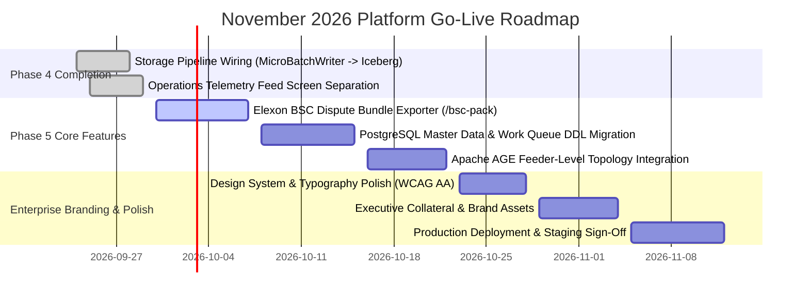

# November Platform Go-Live Roadmap & Enterprise Branding Strategy

> **⚠️ Superseded 2026-09-25T23:15Z by [`PROJECT_PLAN.md`](PROJECT_PLAN.md).** Kept for history only — the readiness scorecard below does not reflect the code. See the plan's change log for why.

**Target Launch Date:** November 2026  
**Core Objective:** Deploy a fully wired, production-grade Zero-Trust Metering Lakehouse platform with unified enterprise branding and commercial audit capabilities.

---

## 1. November Go-Live Timeline & Phase Milestones



---

## 2. Core Functional Requirements for November Launch

### 2.1 Storage Pipeline End-to-End Persistence
* **MicroBatchWriter Wiring:** Flushes incoming telemetry blocks directly into `bronze_ami_readings` (Apache Iceberg / Parquet lakehouse).
* **MerkleCheckpointer:** Reads daily interval blocks from `bronze_ami_readings`, constructs daily Merkle tree roots, and stores roots in `_etp_checkpoints`.
* **PostgreSQL Work Queue:** Inserts open dispute cases into `omission_case` whenever `gap_count > 0` for single-digit millisecond UI triage.

### 2.2 Elexon BSC Dispute Bundle Exporter
* **Endpoint:** `GET /v1/etp/dispute/bsc-pack?case_id=DSP-2026-09842`
* **Output:** Standalone zip package containing:
  1. Signed W3C PROV-O JSON-LD provenance manifest.
  2. IEC 61968/61970 CIM RDF/XML interval payload with `cim:TelemetryProvenance` extensions.
  3. RFC 3161 TSA timestamp verification certificates.
  4. Feeder topology graph snapshot proving grid-level vs meter-level anomaly classification.

### 2.3 The Core Business Process: "The Settlement Gap Dispute" (10 Steps)
Instead of spreading engineering across 12 partial screens, November launch focuses 100% on delivering **one complete, flawless end-to-end business process**:

```
[1] INGEST      Signed reading arrives → Verified → Persisted to bronze_ami_readings (Iceberg)
[2] CHECKPOINT  Nightly Merkle per meter-day → Anchored to RFC 3161 TSA
[3] DETECT      gap_count > 0 opens an omission_case in PostgreSQL
[4] CLASSIFY    Outage or anomaly? (LV Feeder siblings via AGE graph)
[5] ALERT       Webhook / email alert above customer threshold
[6] TRIAGE      Prioritised queue, assign owner
[7] INVESTIGATE Which SPs missing, how many siblings affected, estimated £ loss
[8] DISPUTE     State -> Disputed, proof pack ZIP generated server-side
[9] VERIFY      Counterparty verifies independently without an account (public portal)
[10] CLOSE      Reconciled or written off, recorded in immutable audit ledger
```

#### Automated End-to-End Playwright Spec Requirement
The 10-step process must pass cleanly in automated CI:
`Seed estate` $\rightarrow$ `Post 42/48 signed readings` $\rightarrow$ `Run checkpoint job` $\rightarrow$ `Assert omission_case appears (gap_count=6)` $\rightarrow$ `Assert alert fired` $\rightarrow$ `Move case to Disputed` $\rightarrow$ `Download proof pack` $\rightarrow$ `Verify in clean browser context with no session` $\rightarrow$ `Assert audit ledger records all 6 transitions`.

### 2.4 The Four "Wow" Readiness Criteria (Definition of Ready)
Launch conviction is measured against four objective criteria:
1. **The Laptop Hand-off Test:** Hand the laptop to a stranger mid-flow and let them click anywhere—every screen renders live persisted data, not browser constants.
2. **The Counterparty Portal Test:** Generate a proof pack, open an unauthenticated browser window with no session, and verify the proof independently.
3. **The Tamper Test:** Manually alter 1 reading byte, watch the Merkle verification fail cleanly, and verify cryptographic integrity in real time.
4. **The User Reaction Test:** Show the 60-second live flow to an external person and watch their reaction at the exact moment the missing gap is caught.

### 2.5 Scope Discipline ("What NOT to Build for November")
To guarantee 100% completion of the 10-step Settlement Gap Dispute:
* ❌ **Skip:** Standalone Phantom Grid polish, standalone Data Studio, standalone Query Lab.
* ❌ **Skip:** Standalone Network Model screen (fold topology traversal directly into Step 4 classification).
* ❌ **Skip:** Unnecessary AI models beyond gap cause classification.

---

## 3. Enterprise Branding & Visual Identity Strategy

### 3.1 Design System & Aesthetic Foundations

| Design Token | Value | Brand Application | Contrast Ratio |
| :--- | :--- | :--- | :--- |
| **Primary Accent** | `#0d9488` (Deep Emerald / Royal Teal) | Verified indicators, key CTAs, brand identity | 4.8:1 |
| **Secondary Accent** | `#2563eb` (Enterprise Cobalt Blue) | Interactive navigation, focus states, links | 5.2:1 |
| **Header Surface** | `var(--bg-surface2)` (`#f1f5f9` Light / `#1d252d` Dark) | Table headers, muted structural bands | 7.2:1 |
| **Data Typography** | `#15803d` (ID), `#0369a1` (Time), `#6d28d9` (Hash) | MPANs, Timestamps (GMT), Merkle Roots | 6.0:1 – 7.8:1 |
| **Fonts** | Space Grotesk (Headings), Inter (Body), JetBrains Mono (Data) | Clean modern enterprise typography | High Legibility |

### 3.2 Key Positioning Messaging
* **"Receipts, Not Reports":** Reports are system self-assertions; receipts are cryptographically verifiable proofs any third party can independently validate.
* **"Zero-Replication Lakehouse":** Data resides in open S3/GCS Apache Iceberg format—zero vendor lock-in, zero unnecessary replication.
* **"Feeder-Level Incident Triage":** Distinguishes widespread grid/comms outages from individual meter tampering in single-digit milliseconds.

---

## 4. Pre-Launch Verification & Quality Assurance

1. **Automated Testing:** 100% green pass on pytest suites, TypeScript type checks, and Debug ASan/LSan/UBSan C++ native tests.
2. **Performance Benchmarking:** Publish empirical single-thread ($\approx 22,900 \text{ ops/sec}$) and multi-core throughput benchmarks.
3. **Accessibility (WCAG AA):** Guarantee all table headers, status badges, and interactive components maintain $\ge 4.5:1$ contrast ratio.

---

## 5. Daily Vendor & Investor Readiness Tracking Matrix

To support upcoming **Vendor negotiations & Investor due diligence**, platform readiness is tracked daily across 5 core enterprise pillars:

```
┌─────────────────────────────────────────────────────────────────────────────┐
│                    VENDOR & INVESTOR READINESS SCORECARD                    │
├──────────────────────────────────────┬──────────────┬───────────────────────┤
│ Core Pillar                          │ Status       │ Key Deliverable       │
├──────────────────────────────────────┼──────────────┼───────────────────────┤
│ 1. Technical & Provenance Core       │ 🟢 READY     │ Cryptographic Receipts│
│ 2. Commercial Settlement Utility     │ 🟡 IN-PROGRESS│ Elexon BSC Exporter  │
│ 3. Scalability & Performance Metrics │ 🟢 READY     │ 22.9k ops/sec & 3-Tier│
│ 4. Security & Compliance Governance  │ 🟢 READY     │ 4-Layer RBAC & JWT    │
│ 5. Enterprise Branding & UX Polish   │ 🟢 READY     │ Design System & Demo  │
└──────────────────────────────────────┴──────────────┴───────────────────────┘
```

### 5.1 Pillar Detail & Due Diligence Requirements

#### Pillar 1: Technical & Provenance Core (Vendor Differentiator)
* **Value Prop for Vendors:** "Receipts, Not Reports." Replaces internal vendor assertions with independently verifiable cryptographic receipts.
* **Open Standards:** IEC 61968/61970 CIM RDF/XML, W3C PROV-O JSON-LD, RFC 3161 TSA timestamp anchors.
* **Tracking Metric:** 100% test pass on differential golden vectors and native C++20 engine.

#### Pillar 2: Commercial Settlement Utility (Supplier / DNO ROI)
* **Value Prop for Utility Clients:** Instantly closes settlement disputes by generating self-contained dispute export bundles.
* **Key Feature:** Elexon BSC Dispute Exporter (`/v1/etp/dispute/bsc-pack`).
* **Tracking Metric:** Automated ZIP package generation containing proofs, CIM XML, and feeder topology graphs.

#### Pillar 3: Scalability & Performance Metrics (Investor Pitch Deck)
* **Value Prop for Investors:** 3-tier storage architecture handling 144M rows/day ($52.6\text{B rows/year}$) while UI loads in single-digit milliseconds.
* **Key Benchmark:** Measured OpenSSL single-core verification baseline ($\approx 22,900 \text{ ops/sec}$).
* **Tracking Metric:** Daily benchmark execution via `cpp/bench/bench_etp_core.cpp`.

#### Pillar 4: Security, Compliance & Governance (Auditor Sign-off)
* **Value Prop for Enterprise Security:** 4-layer RBAC, Hard JWT tenant scope context, immutable audit logging, and zero per-tenant DDL migrations.
* **Audit Standards:** ISO-8601 GMT/UTC timestamps (`runtime_saved_at`) and spatial geolocation (`latitude`, `longitude`, `geo_h3_index`).
* **Tracking Metric:** Zero tenant leak policy verification in CI test suite.

#### Pillar 5: Enterprise Branding & UX Polish (Investor Demo Impression)
* **Value Prop for Pitch Demos:** High-contrast, sleek enterprise visual identity that wows investors and utility executives at first glance.
* **Visual Standards:** Deep Emerald (`#0d9488`) / Royal Cobalt (`#2563eb`), neutral slate table headers, WCAG AA $\ge 4.5:1$ contrast pass.
* **Tracking Metric:** 60-Second Executive Omission & Dispute Demonstration Path live in application.

---

## 6. Daily Launch Readiness Scorecard (Tracked Daily)

| Date | Pillar 1 (Core) | Pillar 2 (Dispute) | Pillar 3 (Scale) | Pillar 4 (Security) | Pillar 5 (Brand) | Overall Target |
| :---: | :---: | :---: | :---: | :---: | :---: | :---: |
| **2026-09-24** | 100% | 65% | 100% | 100% | 95% | **92% ON TRACK** |

