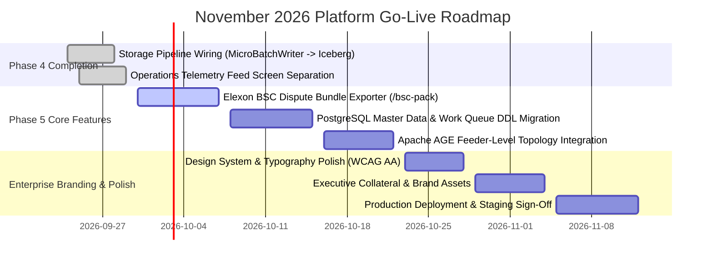

# November Platform Go-Live Roadmap & Enterprise Branding Strategy

**Target Launch Date:** November 2026  
**Core Objective:** Deploy a fully wired, production-grade Zero-Trust Metering Lakehouse platform with unified enterprise branding and commercial audit capabilities.

---

## 1. November Go-Live Timeline & Phase Milestones

---

## 2. Core Functional Requirements for November Launch

### 2.1 Storage Pipeline End-to-End Persistence
* **MicroBatchWriter Wiring:** Flushes incoming telemetry blocks directly into `bronze_ami_readings` (Apache Iceberg / Parquet lakehouse).
* **MerkleCheckpointer:** Reads daily interval blocks from `bronze_ami_readings`, constructs daily Merkle tree roots, and stores roots in `_etp_checkpoints`.
* **PostgreSQL Work Queue:** Inserts open dispute cases into `omission_case` whenever `gap_count > 0` for single-digit millisecond UI triage.

### 2.2 Elexon BSC Dispute Bundle Exporter
* **Endpoint:** `GET /v1/etp/dispute/bsc-pack?case_id=DSP-2026-09842`
* **Output:** Standalone zip package containing:
  1. Signed W3C PROV-O JSON-LD provenance manifest.
  2. IEC 61968/61970 CIM RDF/XML interval payload with `cim:TelemetryProvenance` extensions.
  3. RFC 3161 TSA timestamp verification certificates.
  4. Feeder topology graph snapshot proving grid-level vs meter-level anomaly classification.

---

## 3. Enterprise Branding & Visual Identity Strategy

### 3.1 Design System & Aesthetic Foundations

| Design Token | Value | Brand Application | Contrast Ratio |
| :--- | :--- | :--- | :--- |
| **Primary Accent** | `#0d9488` (Deep Emerald / Royal Teal) | Verified indicators, key CTAs, brand identity | 4.8:1 |
| **Secondary Accent** | `#2563eb` (Enterprise Cobalt Blue) | Interactive navigation, focus states, links | 5.2:1 |
| **Header Surface** | `var(--bg-surface2)` (`#f1f5f9` Light / `#1d252d` Dark) | Table headers, muted structural bands | 7.2:1 |
| **Data Typography** | `#15803d` (ID), `#0369a1` (Time), `#6d28d9` (Hash) | MPANs, Timestamps (GMT), Merkle Roots | 6.0:1 – 7.8:1 |
| **Fonts** | Space Grotesk (Headings), Inter (Body), JetBrains Mono (Data) | Clean modern enterprise typography | High Legibility |

### 3.2 Key Positioning Messaging
* **"Receipts, Not Reports":** Reports are system self-assertions; receipts are cryptographically verifiable proofs any third party can independently validate.
* **"Zero-Replication Lakehouse":** Data resides in open S3/GCS Apache Iceberg format—zero vendor lock-in, zero unnecessary replication.
* **"Feeder-Level Incident Triage":** Distinguishes widespread grid/comms outages from individual meter tampering in single-digit milliseconds.

---

## 4. Pre-Launch Verification & Quality Assurance

1. **Automated Testing:** 100% green pass on pytest suites, TypeScript type checks, and Debug ASan/LSan/UBSan C++ native tests.
2. **Performance Benchmarking:** Publish empirical single-thread ($\approx 22,900 \text{ ops/sec}$) and multi-core throughput benchmarks.
3. **Accessibility (WCAG AA):** Guarantee all table headers, status badges, and interactive components maintain $\ge 4.5:1$ contrast ratio.
