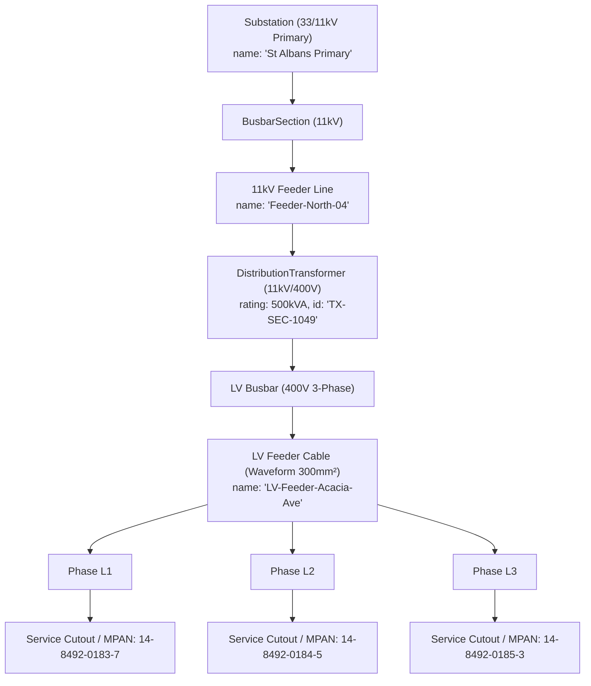

# ARC-005 / DT-001 — The AI Grid Digital Twin Specification: Low-Voltage Operational Intelligence & Telemetry Analytics

**Document ID:** ARC-005 · **Version:** 1.0 · **Classification:** Core Architecture & Domain Specification  
**Authority:** Meldra AI Engineering & Power Systems Architecture  
**Target Sector:** UK Distribution Network Operators (DNOs / DSOs), Energy Regulators (Ofgem), Utilities  
**Compliance Standards:** ISO 23247 (Digital Twin Framework), IEC 61968/61970 (CIM), Elexon BSC / MHHS, IEEE PES  
**Issued:** 2026-09-09  

---

## 1. Executive Definition & The Problem We Solve

### 1.1 Formal Definition
> **Meldra is an Open-Architecture AI Grid Digital Twin for Low-Voltage (LV) Network Operations.**
> 
> It continuously couples physical electrical network topology (IEC 61968 Common Information Model) in a high-performance graph engine directly to petabyte-scale smart meter telemetry on an open Apache Iceberg lakehouse. By executing in-engine state estimation, topological machine learning, and quantum-inspired optimization over zero-copy columnar data, it delivers sub-second visibility into **LV feeder headroom, phase unbalance, and EV hosting capacity** without requiring billions of pounds in physical substation sensor retrofits.

```
┌─────────────────────────────────────────────────────────────────────────────┐
│                       MELDRA AI GRID DIGITAL TWIN                           │
├─────────────────────────────────────────────────────────────────────────────┤
│ 1. TOPOLOGICAL TWIN (The Physical Asset Skeleton)                           │
│    • CIM IEC 61968/61970 electrical connectivity network                    │
│    • Primary Substation (33/11kV) → Feeder → Secondary Transformer (11kV/400V) │
│      → LV Feeder Cable → Service Cutout → MPAN (230V Home)                 │
│    👉 Powered by: Apache AGE & NetworkX Graph Engine                        │
├─────────────────────────────────────────────────────────────────────────────┤
│ 2. TELEMETRY & STATE TWIN (The Dynamic Operational Pulse)                   │
│    • Continuous Half-Hourly timeseries (kW, kvar, Volts, Amps)              │
│    • 52+ billion rows/year per 3M meters with time-travel reproducibility    │
│    👉 Powered by: Apache Iceberg, Parquet & DuckDB Zero-Copy Arrow          │
├─────────────────────────────────────────────────────────────────────────────┤
│ 3. COGNITIVE & PREDICTIVE TWIN (The In-Engine AI Brain)                     │
│    • Automated Phase Identification (predicting L1/L2/L3 connectivity)     │
│    • Dynamic Feeder Headroom & Thermal Overload Simulation                  │
│    • Combinatorial Network Reconfiguration & QUBO Optimization              │
│    👉 Powered by: In-Engine Topological Embeddings & QISA Annealing         │
├─────────────────────────────────────────────────────────────────────────────┤
│ 4. OPERATIONAL DECISION & DISPATCH LOOP                                     │
│    • Sub-second Feeder Headroom Analytics                                   │
│    • Reverse Power Flow & Statutory Voltage Compliance (+10% / -6%)         │
│    • "What-If" EV & Heat Pump Penetration Forecasting                       │
└─────────────────────────────────────────────────────────────────────────────┘
```

### 1.2 The Industry Distinction: Real Computational Twin vs. "Dashboard Candy"
DNO engineers frequently reject "Digital Twin" pitches because 95% of vendors sell superficial 3D CAD models (spinning 3D substations with colored dots) that lack grid physics and cannot ingest high-frequency telemetry.

* **The Fake Twin:** A visual 3D skin with hardcoded demo data and no physics. It collapses when asked to compute real-time load flows across 10,000 meters.
* **The Meldra Real Twin:** The **mathematical, topological, and analytical engine** that fuses real CIM electrical connectivity with billions of raw telemetry rows to solve physical grid constraints in sub-second latency.

---

## 2. Why Low Voltage (LV)? — The Multi-Billion-Pound Operational Crisis

The electricity network is divided into three distinct operational tiers, but **the crisis is entirely concentrated at Low Voltage**:

```
National Transmission Grid (400kV / 275kV / 132kV)
├── Status: 100% Monitored (SCADA, Fiber-optic telemetry, PMUs on every asset)
│
Primary Distribution Network (33kV / 11kV)
├── Status: 100% Monitored (RTUs in every Primary Substation, SCADA remote control)
│
Secondary Substations (11kV / 400V) & Low-Voltage Street Feeders
└── Status: ❌ 90%+ UNMONITORED BLIND SPOT across 800,000+ UK Substations
    └── Customer Cutouts / Premises (230V Single-Phase)
        └── Status: ✅ The ONLY Sensor on the Street: The Smart Meter (MPAN)!
```

### 2.1 The "Fit and Forget" Legacy
For over seven decades, the Low Voltage network (400V three-phase mains cables feeding 230V single-phase homes) operated on a **"fit and forget"** philosophy:
* Power flowed in one direction: from centralized coal/gas plants down to passive domestic lighting and appliances.
* Load curves were predictable and smoothed by broad statistical diversity (ADMD — After Diversity Maximum Demand).
* Consequently, DNOs installed **no instrumentation, no communications, and no sensors** on secondary transformers or street pillars.

### 2.2 The Clean Energy Avalanche at the Grid Edge
The UK net-zero transition is happening **almost entirely on the unmonitored LV network**:
1. **Electric Vehicle (EV) Clustering:** A standard 7kW domestic EV charger draws more power than an entire typical house's baseline peak load (~2–3 kW). When five households on the same street plug in at 18:00, local cable conductors exceed thermal limits.
2. **Domestic Heat Pumps:** Adding 10kW electrical compressors increases winter peak demand and degrades local voltage.
3. **Rooftop Solar PV Backfeed:** On sunny summer afternoons, domestic solar PV feeds power **backwards** up the 400V cable into the 11kV transformer. This reverse power flow pushes voltage above statutory UK limits (+10% / 253V), damaging consumer appliances and tripping inverters.
4. **Phase Imbalance:** Homes are single-phase ($L1, L2,$ or $L3$) connected to three-phase street mains. Uneven EV/PV distribution creates massive neutral currents, accelerating transformer thermal degradation.

### 2.3 Why Hardware Sensors Cannot Solve This Alone (The £3B Capital Barrier)
There are over **800,000 secondary distribution transformers** and millions of kilometers of underground LV cables in Great Britain.
* Retrofitting dedicated physical monitoring hardware (Rogowski coils, RTUs, cellular modems) costs **£3,000 to £8,000 per substation**.
* Rolling this out nationwide requires **£2.5 to £6.4 Billion in capital expenditure**, plus disruptive street excavations.
* DNOs under Ofgem RIIO-ED2 price controls cannot justify this cost to bill-payers.

### 2.4 The Software Resolution: Smart Meters as Virtual Grid Sensors
Under **Market-wide Half-Hourly Settlement (MHHS)**, over 30 million smart meters (SMETS1 / SMETS2) transmit active consumption (kWh), reactive power (kvarh), and voltage measurements.
* **The smart meter is already deployed, already paid for, and already sitting at the end of every LV service cable.**
* By building a **software-defined Digital Twin** that aggregates half-hourly meter telemetry onto the physical CIM cable topology, DNOs achieve 100% LV visibility **at less than 5% of the cost of physical sensor rollouts.**

---

## 3. How the Meldra Platform Satisfies the 4 Digital Twin Criteria

In accordance with **ISO 23247** and **IEEE PES Digital Twin Standards**, Meldra fulfills all required operational dimensions:

| Digital Twin Criterion | Standard Requirement | How Meldra Architecture Satisfies It |
| :--- | :--- | :--- |
| **1. Structural Twin** | Must accurately model physical components and their electrical topology. | **Apache AGE / NetworkX (`graph_executor.py`)**: Implements CIM IEC 61968/61970 electrical hierarchy (Substation $\to$ Transformer $\to$ Feeder $\to$ Phase $\to$ Cutout $\to$ MPAN). |
| **2. Telemetry State Twin** | Must continuously capture and synchronize dynamic operational states. | **Apache Iceberg + DuckDB (`sql_executor.py`, `sql_pushdown.py`)**: Vectorized zero-copy Arrow memory engine storing 52B+ half-hourly readings with sub-second predicate-pruned query times. |
| **3. Cognitive AI Twin** | Must predict missing network states, infer unknown parameters, and simulate outcomes. | **In-Engine AI & Optimization (`ai_ml_engine.py`, `quantum_optimizer.py`)**: Automated phase identification via topological embeddings, link prediction, and QUBO grid partitioning. |
| **4. Decision Support Loop** | Must generate verifiable operational answers for grid operators. | **Automated Feeder Headroom & Voltage Compliance**: Instant calculation of transformer loading, reverse power flow, and EV hosting headroom. |

---

## 4. DNO Operational Use Cases & Proof Scenarios

### Use Case 1: Automated Low-Voltage Feeder Headroom & Thermal Capacity
* **Operational Problem:** DNO planning engineers receive hundreds of daily connection requests for 7kW/22kW EV chargers and commercial heat pumps. Today, they estimate capacity using static spreadsheets and manual diversity factors, leading to either unnecessary network reinforcement or unmonitored cable melting.
* **Digital Twin Solution:**
  1. Operator submits the target Secondary Substation ID (e.g., `SS-40291`) and Feeder ID (e.g., `LV-F-02`).
  2. The **Graph Engine** walks downstream connectivity to retrieve all associated MPANs.
  3. The **Iceberg Engine** runs a pushdown query across the last 12 months of half-hourly load curves during peak settlement periods (Periods 34–38: 17:00–19:00).
  4. The **Twin** aggregates instantaneous load against cable thermal ratings ($I_{\text{rated}}$), calculating exact remaining headroom in kW and kVA in **< 0.5 seconds**.

### Use Case 2: In-Engine Unsupervised Phase Identification ($L1, L2, L3$)
* **Operational Problem:** Due to decades of undocumented service connections, DNOs **do not know which phase ($L1, L2, L3$) 30% to 50% of domestic customers are connected to**. Without phase knowledge, engineers cannot balance loads or prevent neutral burn-outs.
* **Digital Twin Solution:**
  1. The **AI Engine (`AIMLEngine.generate_node_embeddings`)** computes topological embeddings over voltage timeseries profiles.
  2. Because meters on the same physical phase share correlated voltage drops, spectral clustering groups MPANs into three distinct clusters corresponding to $L1, L2,$ and $L3$.
  3. Returns high-confidence phase assignments without digging test pits or dispatching field teams.

### Use Case 3: Reverse Power Flow & Statutory Voltage Compliance
* **Operational Problem:** In areas with high solar PV density, reverse power flow drives local voltage above the statutory limit of $230\text{V} + 10\% = 253\text{V}$, creating liability for customer equipment damage.
* **Digital Twin Solution:**
  1. Predicate pushdown query scans Iceberg Silver/Gold marts for negative active power ($kW < 0$) and voltage thresholds ($V > 253.0\text{V}$) during settlement periods 20–28 (10:00–14:00).
  2. The graph engine correlates affected MPANs back to upstream secondary transformers.
  3. Identifies exact transformers requiring tap changes or localized solar export curtailment.

---

## 5. UK Grid Standards & Authentic Data Structures

Meldra strictly adheres to real UK utility conventions, eliminating synthetic placeholders:

### 5.1 Authentic 13-Digit MPAN Structure
```
┌─────────────────┬──────────────┬───────────────┐
│ Profile Class   │ MTC (Timesw) │ LLFC (Losses) │  Top Line (Supplementary)
│ 01 (Domestic)   │ 801 (Std)    │ 100 (LV Net)  │  [2 digits - 3 digits - 3 digits]
├─────────────────┼──────────────┼───────────────┤
│ Distributor ID  │ Unique ID    │ Check Digit   │  Bottom Line (Core MPAN)
│ 14 (Midlands)   │ 84920183     │ 7             │  [2 digits - 8 digits - 1 digit]
└─────────────────┴──────────────┴───────────────┘
Core MPAN: 14 8492 0183 7
```

### 5.2 Elexon MHHS Settlement Periods
* **Frequency:** 48 half-hourly settlement periods per day (Period 1 = 00:00–00:30, Period 48 = 23:30–00:00).
* **Clock Change Handling:** 46 periods on short clock-change day (spring), 50 periods on long clock-change day (autumn).

### 5.3 CIM IEC 61968 / 61970 Asset Hierarchy


---

## 6. DNO Engagement & Innovation Procurement Roadmap

### 6.1 The Regulatory Vehicle: Ofgem Network Innovation Allowance (NIA)
Under RIIO-ED2, each UK DNO has a dedicated innovation budget:
* **UK Power Networks (UKPN):** ~£8–10M/year NIA budget
* **National Grid Electricity Distribution (NGED):** ~£12–15M/year NIA budget
* **SSE Networks (SSEN) / SP Energy Networks (SPEN):** ~£6–9M/year NIA budget

NIA projects are specifically structured for small technology companies and solo innovators with working software prototypes. They do not require large-scale commercial procurement tenders.

### 6.2 The Engagement Pathway
1. **Submission via EIC (Energy Innovation Centre):** Submit a 4-page innovation proposal to [the-eic.com](https://www.the-eic.com/) addressing live DNO calls for *"Low Voltage Visibility and Smart Meter Data Utilization."*
2. **60-Day Innovation Sandbox Trial:**
   * DNO provides 6 months of anonymized, historical half-hourly telemetry for 50,000 MPANs and an export of one 11kV/400V network CIM file.
   * Meldra ingests the data into Apache Iceberg, constructs the CIM topology graph, and executes benchmark headroom and phase identification queries.
   * Delivers proof report comparing sub-second query latency and accuracy against their legacy Oracle/SAP warehouse.

---

## 7. Document Control & Sign-off

| Version | Date | Author | Status |
|---|---|---|---|
| 1.0 | 2026-09-09 | Meldra AI Engineering | Approved Architecture Specification |
